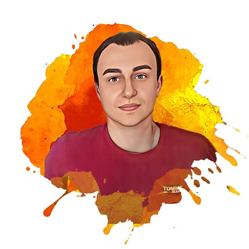

# About me: Ukrainskyi Oleksandr

*** 
*** 

# Contacts:

### olex0207ee@gmail.com
### https://www.linkedin.com/in/oleksandr-ukrainskyi-617b89247
### +372555****7

***
***

# General Info: 

### I have been working as a PHP over 12 years. And now I want to improve my JavaScript skills.

***
***

# Skills:

### HTML, CSS, JavaScript, PHP, MySQL, Figma, React JS, Symfony, Git, Jira

***
***

# Code example:

```javascript
import React, { useEffect } from 'react';

useEffect(() => {
  console.log('Hello world!');
}, []);
```

# Work Experience:

### 1. ZFORT Group (Full-stack Developer)
### 2. RAPID DEVELOPMENT SERVICES (Full-stack Developer)
### 3. PHP Link Directory (Full-stack Developer)

***
***

# Education

### Shidnoukrains'kij Nacional'nij Universitet im. Volodimira Dalja

***
***

# Languages:

### English B1

***
***
